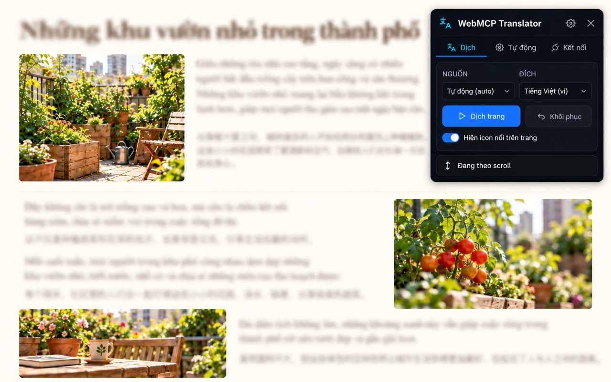
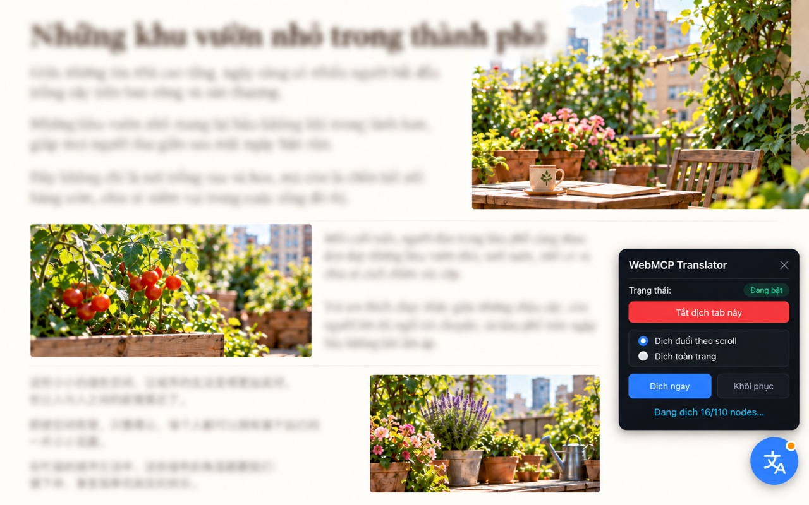

# Nội dung chuẩn bị cho Chrome Web Store — WebMCP Translator

Ngày kiểm tra Dashboard: 2026-10-01. Tab được người dùng cung cấp thuộc item **WebMCP Tools Provider** đã Published (ID `lbodkmkjbcemodklopcfdmpjomdoapae`) trong publisher `hieu2906090`, **không phải** WebMCP Translator. Chỉ dùng form này làm tham chiếu, không sửa item đó. Các trường thực tế của item Translator cần kiểm lại sau khi upload đúng ZIP.

## 1. Trường Dashboard đã xác nhận trực tiếp

| Store listing | Tình trạng trên form đang mở | Chuẩn bị cho Translator |
| --- | --- | --- |
| Title, Summary | Đọc từ manifest của package | Sửa manifest cho người dùng cuối trước build; không thể sửa hai trường này trong listing. |
| Description | Bắt buộc, tối đa 16.000 ký tự | Bản nháp ở mục 2. |
| Category, Language | Chọn trong form | Đề xuất `Tools`, `Vietnamese` vì popup hiện bằng tiếng Việt; xác nhận khi tạo item. |
| Store icon | Bắt buộc, 128×128 | Dùng `extension/src/icons/icon128.png` sau khi kiểm tra thiết kế/quyền sử dụng. |
| Screenshots | **Bắt buộc ít nhất 1**, tối đa 5; 1280×800 hoặc 640×400; JPEG hoặc PNG 24-bit **không alpha** | Mục 4 chỉ dẫn chụp từ bản extension chạy thật. Chưa có screenshot Store hợp lệ trong package. |
| Global promo video | Ô URL YouTube, không đánh dấu bắt buộc | Để trống cho bản nộp tối giản. |
| Small promo tile | 440×280, không đánh dấu bắt buộc | Để trống cho bản nộp tối giản. |
| Marquee promo tile | 1400×560, không đánh dấu bắt buộc | Để trống. |
| Official URL, Homepage URL, Support URL | Không đánh dấu bắt buộc | Cung cấp URL công khai nếu có; Privacy policy URL ở tab Privacy là trường bắt buộc khi xử lý user data. |

Tab **Privacy** có: Single purpose description (1.000 ký tự), giải trình từng quyền (mỗi ô 1.000 ký tự), khai remote code, data usage categories, ba chứng nhận Limited Use, Privacy policy URL. Tab **Test instructions** có Username và Password (mỗi ô 100 ký tự), Additional instructions (500 ký tự). Có thể dùng Username làm Base URL và Password làm API key **chỉ khi** đã cấp riêng một endpoint/key thử ổn định cho reviewer; không đưa key thật vào tài liệu này.

## 2. Bản nháp nội dung Store listing

**Đề xuất manifest name:** `WebMCP Translator` — thay cho `WebMCP Translator Kit` khi sẵn sàng release. **Đề xuất manifest description (dưới 132 ký tự):**

> Dịch nội dung trang web sang tiếng Việt bằng API AI do bạn cấu hình, với quyền truy cập theo từng trang.

Đây là đề xuất sửa manifest, **chưa phải giá trị đã có trong ZIP**. Trước khi thay, kiểm tra tên/ID đã được tích hợp khác dùng và version release.

**Description để dán vào Store Listing (tiếng Việt):**

> WebMCP Translator giúp bạn dịch văn bản trên trang web sang tiếng Việt hoặc ngôn ngữ đích đã chọn. Bạn tự cung cấp Base URL của dịch vụ AI tương thích OpenAI và API key; extension không kèm tài khoản hay hạn mức dịch.
>
> Cách dùng:
> 1. Mở tab Kết nối, nhập Base URL và API key, rồi chọn model.
> 2. Mở trang cần dịch và bấm “Dịch trang”. Extension xin quyền truy cập trang đó và kết nối tới Base URL bạn đã chọn.
> 3. Bấm “Khôi phục” để trả lại văn bản gốc. Bạn có thể cấu hình riêng các trang muốn tự dịch và tắt tính năng này bất cứ lúc nào.
>
> Khi dịch vụ AI hỗ trợ phản hồi dạng stream, các đoạn dịch hoàn chỉnh có thể xuất hiện dần trong lúc xử lý. Với phản hồi JSON thông thường, kết quả được hiển thị sau khi dịch vụ trả xong. Tốc độ và chất lượng phụ thuộc vào endpoint và model bạn chọn.
>
> Quyền riêng tư: Extension đọc văn bản của trang bạn chọn để gửi đến Base URL đã cấu hình nhằm tạo bản dịch. Nếu bạn cấu hình các endpoint dự phòng, văn bản có thể được gửi tới một endpoint dự phòng khi endpoint chính gặp lỗi đủ điều kiện. Nội dung trang có thể chứa thông tin cá nhân; hãy chỉ bật dịch trên những trang mà bạn chấp nhận gửi nội dung tới dịch vụ đã chọn. API key và tùy chọn được lưu trong bộ nhớ cục bộ của extension. Xem Privacy Policy để biết chi tiết về dữ liệu, bên nhận và cách xóa.
>
> Extension không dịch ô nhập liệu, mật khẩu hoặc vùng văn bản đang chỉnh sửa. Chỉ những site được cấp quyền mới có thể bật chế độ dịch tự động. Cần Chrome và dịch vụ AI/API key riêng để sử dụng.

**Điều kiện trước khi dùng copy:** sửa xong disclosure/consent và endpoint HTTPS/loopback trong kế hoạch; xác minh mọi câu với ZIP cuối cùng; có Privacy Policy công khai và reviewer test endpoint. Câu “không dịch ô nhập liệu…” được hỗ trợ bởi `content.js:90-114`, nhưng vẫn phải chạy negative test trên build cuối. Câu stream được hỗ trợ bởi `adapter/direct9router.mjs:350-405,554-724`, `sw.js:1446-1460`, `content.js:1823-1865`; kiểm tra real UI trước khi đưa vào listing cuối.

## 3. Nội dung chuẩn bị cho Privacy và Test instructions

**Single purpose description (đề xuất, dưới 1.000 ký tự):**

> Dịch văn bản của trang web mà người dùng chủ động chọn hoặc đã bật tự dịch cho site đó, bằng endpoint AI do người dùng cấu hình; cho phép khôi phục văn bản gốc.

**Permission justifications (đề xuất, điều chỉnh theo manifest cuối):**

- `activeTab`: Truy cập tab hiện tại khi người dùng bấm extension/Dịch để xác định trang cần dịch và chỉ thao tác trên tab đó.
- `scripting`: Chèn content script đọc, thay thế và khôi phục text nodes trên site người dùng đã cấp quyền; đăng ký cho site tự dịch đã chọn.
- `storage`: Lưu Base URL, model, site được bật, API key ở `storage.local`; giữ trạng thái tab và giới hạn yêu cầu tạm thời trong `storage.session`.
- Optional host permissions: Xin quyền cho **origin cụ thể** của trang người dùng chọn và của API endpoint họ cấu hình. Không tự truy cập tất cả site chỉ vì manifest cho phép khai báo các origin tùy chọn.

**Remote code:** đề xuất chọn `No` sau khi kiểm tra ZIP cuối không tải hoặc chạy JS/Wasm từ mạng. SSE/JSON trả về **văn bản dịch**, không phải mã được `eval`. Kết nối từ xa để dịch dữ liệu cần khai trong phần data usage và policy, nhưng không tự động là remote hosted code.

**Data usage:** chắc chắn cần đánh giá `Website content`; API key người dùng nhập cần đánh giá `Authentication information`, kể cả khi chỉ lưu cục bộ. Vì extension có thể đọc văn bản trang bất kỳ được cấp quyền, trang đó có thể chứa PII, liên lạc cá nhân, sức khỏe hoặc tài chính. Chốt chính xác checkbox với phạm vi tính năng/data map và hướng dẫn của Dashboard; **không** tích mặc định “không thu thập dữ liệu”. Chỉ chứng nhận ba mục Limited Use khi hành vi, policy và bên nhận đã được xác minh. Privacy policy URL công khai là gate bắt buộc.

**Test instructions:** form hiện tại chỉ cho 500 ký tự Additional instructions. Khi có endpoint/key reviewer, điền Base URL vào `Username` và key thử vào `Password` trên Dashboard, rồi dùng bản nháp sau:

> Open the extension popup > Kết nối. Use the Username field above as Base URL and Password as API key. Click the model refresh icon and choose an available model. Open a public article page, click Dịch > Dịch trang, and confirm text is translated. Click Khôi phục to restore it. For SSE-capable models, completed passages appear progressively; otherwise they appear when the response finishes. Do not use private pages. This review key is limited to testing.

Không dán bản này nếu chưa có endpoint/key dùng được từ máy reviewer. Nếu reviewer không thể truy cập local 9router, phải cấp HTTPS endpoint thử; không dùng `localhost` trong instructions của họ.

## 4. Ảnh Store tạm và gate cho bản nộp

Theo yêu cầu mới nhất của owner, đã tạo lại **hai mockup tạm bằng ImageGen** từ bộ v2: chữ của bài đọc phía sau được làm mờ, còn phần extension giữ sắc nét để trở thành điểm nhìn chính.

- **Ảnh 1 — popup nổi bật:** [JPEG 1280×800](./store-assets/translator-store-popup-v3-blurred-1280x800.jpg), chỉ có UI popup extension, không có floating widget/icon. SHA-256 `aa7b986ee89c277f391b9b6957d0e50d50da6ddd073fb56fba6b88975fdce0b4`.
- **Ảnh 2 — floating icon nổi bật:** [JPEG 1280×800](./store-assets/translator-store-floating-v3-blurred-1280x800.jpg), có icon tròn xanh ở góc phải dưới và panel nổi, không có popup extension. SHA-256 `ded41f90c3ded204dc6b428347cebac1d046d51901746a5e5b0060bc658731f7`.
- [Prompt chỉnh ảnh v3](./store-assets/translator-store-v3-prompts.md). [Bộ v2 chữ rõ](./store-assets/translator-store-v2-prompts.md) và [v1 gộp popup với widget](./store-assets/translator-store-mockup-v1-1280x800.jpg) được giữ làm tham khảo.

**Trạng thái: mockup để duyệt nội bộ.** Hai ảnh là ảnh dựng, không phải capture từ ZIP release; trang mẫu có ảnh và câu chữ do ImageGen tạo. Popup/widget/icon được mô phỏng theo ảnh người dùng cung cấp và phản ánh chức năng dịch dần hiện có, nhưng một số chi tiết hiển thị có thể khác bản extension cuối. Trước khi upload/Submit for Review, so từng thành phần với bản chạy thật, sửa hoặc thay ảnh nếu khác đáng kể; [Listing Requirements](https://developer.chrome.com/docs/webstore/program-policies/listing-requirements) đòi listing chính xác, không gây hiểu lầm.

**Ảnh tham chiếu SSE:** người dùng cung cấp [`sse-progress-reference-2026-10-01.png`](./store-assets/sse-progress-reference-2026-10-01.png), SHA-256 `f8d6774350a0c6aeb3774e240d2816aebfe24931af2d4ded9b8dfe39b0834067`. Ảnh gốc là PNG 2916×1714 RGBA, 894.386 byte. Popup và widget hiện rõ; widget báo `Đang dịch 16/110 nodes`, vài đoạn đầu đã là tiếng Việt trong khi các đoạn sau vẫn là tiếng Trung. Ảnh chứng minh **trạng thái hiển thị dần**, còn việc transport đúng SSE được xác nhận riêng bằng mã nguồn và test. Không thấy API key trong ảnh.

Ảnh tham chiếu **không upload trực tiếp**: sai kích thước, có kênh alpha, đang chụp nội dung tiểu thuyết bên thứ ba và chưa gắn được với ZIP hash của release candidate. Source có `icon128.png` nhưng đó là **Store icon**, không thay thế screenshot. Form Dashboard bắt buộc ít nhất một ảnh 1280×800 hoặc 640×400, JPEG hoặc PNG 24-bit không alpha. Công cụ trình duyệt từ chối thao tác xuất ảnh capture thử qua URL `data:` theo browser security policy; ảnh mockup trên được tạo bằng công cụ ImageGen riêng theo yêu cầu của owner, không dùng đường vòng để trích xuất capture đó.

Đã thử giao diện thật với `extension/dist` và trang minh họa [`demo-page.html`](./store-assets/demo-page.html) qua local SSE fixture [`demo-server.mjs`](./store-assets/demo-server.mjs): trang đã hiển thị các đoạn tiếng Việt, widget bật/tắt và khôi phục xuất hiện. Fixture dùng **bản dịch định sẵn** để kiểm tra UI, không đánh giá chất lượng model thương mại. Bản unpacked đã được gỡ khỏi Chrome profile `hieu2906090` sau khi thử.

Để tái hiện trong môi trường thử nghiệm cục bộ: chạy `node docs/store-assets/demo-server.mjs`, mở `http://127.0.0.1:8097/`, đặt Base URL `http://127.0.0.1:8097/v1` và key giả `demo-only`. Đây là HTTP loopback dành riêng cho fixture, **không phải** endpoint công khai cho Chrome reviewer hoặc cấu hình khuyến nghị cho dữ liệu thật. Không đưa `demo-server.mjs` vào ZIP extension.

Kịch bản tối thiểu cho **Screenshot 1**:

1. Chốt ZIP candidate và cài đúng bản đó vào Chrome profile kiểm thử. Dùng trang minh họa ở trên hoặc một trang công khai được phép sử dụng, không có thông tin cá nhân, giao diện rõ ràng ở kích thước 1280×800.
2. Dịch trang bằng SSE-capable test provider; chụp lúc có kết quả dịch thật và trạng thái extension dễ nhận ra (popup hoặc widget). Không chụp API key, URL nội bộ, tab Dashboard, DevTools hay lỗi.
3. Kiểm tra screenshot phản ánh đúng UI bản nộp, văn bản đọc được, không chứa claim chưa xác minh; xuất JPEG hoặc PNG RGB không alpha ở đúng 1280×800 (hoặc 640×400), lưu vào `docs/store-assets/` và ghi ZIP hash cùng ngày chụp.

Nếu cần **ảnh 3**, có thể cho thấy thiết lập `Tự động` theo site và lựa chọn bật/tắt; **ảnh 4** có thể cho thấy `Khôi phục` sau dịch. Các ảnh bổ sung chỉ cần nếu rõ chức năng hơn hai ảnh trên. Nếu dựng tiếp bằng AI, chỉ dùng chi tiết UI/tính năng đã kiểm chứng và đánh dấu mockup trong docs cho đến khi được đối chiếu với release candidate.

### Gate cho ảnh và copy

- [x] Đã có hai mockup tạm 1280×800 JPG không alpha: popup riêng và floating icon/widget riêng.
- [ ] Đối chiếu mockup với UI build cuối và ZIP hash; xác nhận không có chi tiết sai, claim quá mức hoặc hình ảnh không đúng trải nghiệm người dùng trước upload.
- [ ] Ảnh không chứa credentials, tên cá nhân, dữ liệu nhạy cảm hoặc nội dung có bản quyền chưa được phép dùng quảng bá.
- [ ] Dòng “xuất hiện dần” đã được quan sát trên UI với SSE provider thực và test SSE ở cùng tree xanh; nếu không, bỏ claim streaming khỏi Description và dùng screenshot chỉ thể hiện bản dịch hoàn tất.
- [ ] Description, manifest, Privacy fields, privacy policy và Test instructions cùng nói đúng về endpoint, key, fallback và auto mode.

## 5. Nguồn

- Trường và giới hạn lấy từ Dashboard đang mở của item WebMCP Tools Provider ngày 2026-10-01, chỉ dùng làm mẫu form.
- [Chrome Web Store Listing Requirements](https://developer.chrome.com/docs/webstore/program-policies/listing-requirements), [Listing images](https://developer.chrome.com/docs/webstore/best-listing), [Privacy fields](https://developer.chrome.com/docs/webstore/cws-dashboard-privacy), [MV3 remote code](https://developer.chrome.com/docs/webstore/program-policies/mv3-requirements).
- Đánh giá và các chốt chặn trước nộp: [chrome-web-store-readiness-2026-10-01.md](./chrome-web-store-readiness-2026-10-01.md).
