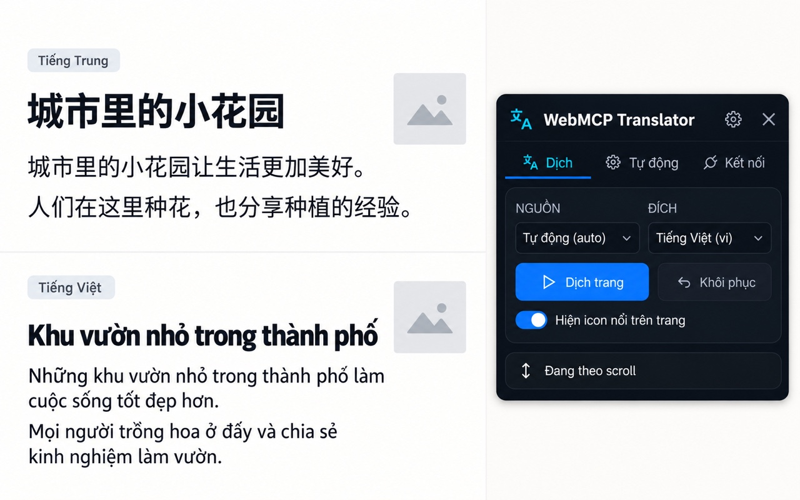
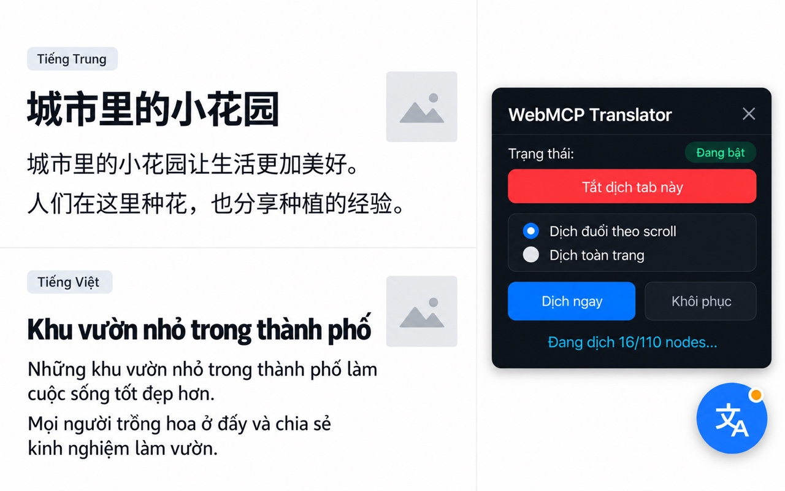

# Nội dung chuẩn bị cho Chrome Web Store — WebMCP Translator

Ngày kiểm tra Dashboard: 2026-10-01. Tab được người dùng cung cấp thuộc item **WebMCP Tools Provider** đã Published (ID `lbodkmkjbcemodklopcfdmpjomdoapae`) trong publisher `hieu2906090`, **không phải** WebMCP Translator. Chỉ dùng form này làm tham chiếu, không sửa item đó. Các trường thực tế của item Translator cần kiểm lại sau khi upload đúng ZIP.

## 1. Trường Dashboard đã xác nhận trực tiếp

| Store listing | Tình trạng trên form đang mở | Chuẩn bị cho Translator |
| --- | --- | --- |
| Title, Summary | Đọc từ manifest của package | Sửa manifest cho người dùng cuối trước build; không thể sửa hai trường này trong listing. |
| Description | Bắt buộc, tối đa 16.000 ký tự | Bản nháp ở mục 2. |
| Category, Language | Chọn trong form | Đề xuất `Tools`, `Vietnamese` vì popup hiện bằng tiếng Việt; xác nhận khi tạo item. |
| Store icon | Bắt buộc, 128×128 | Dùng `extension/src/icons/icon128.png` sau khi kiểm tra thiết kế/quyền sử dụng. |
| Screenshots | **Bắt buộc ít nhất 1**, tối đa 5; 1280×800 hoặc 640×400; JPEG hoặc PNG 24-bit **không alpha** | Mục 4 chỉ dẫn chụp từ bản extension chạy thật. Chưa có screenshot Store hợp lệ trong package. |
| Global promo video | Ô URL YouTube, không đánh dấu bắt buộc | Để trống cho bản nộp tối giản. |
| Small promo tile | 440×280, không đánh dấu bắt buộc | Để trống cho bản nộp tối giản. |
| Marquee promo tile | 1400×560, không đánh dấu bắt buộc | Để trống. |
| Official URL, Homepage URL, Support URL | Không đánh dấu bắt buộc | Cung cấp URL công khai nếu có; Privacy policy URL ở tab Privacy là trường bắt buộc khi xử lý user data. |

Tab **Privacy** có: Single purpose description (1.000 ký tự), giải trình từng quyền (mỗi ô 1.000 ký tự), khai remote code, data usage categories, ba chứng nhận Limited Use, Privacy policy URL. Tab **Test instructions** có Username và Password (mỗi ô 100 ký tự), Additional instructions (500 ký tự). Có thể dùng Username làm Base URL và Password làm API key **chỉ khi** đã cấp riêng một endpoint/key thử ổn định cho reviewer; không đưa key thật vào tài liệu này.

**Cập nhật 2026-10-04:** privacy policy cho item Translator đã được publish tại [https://uyencss.github.io/webmcp-translator-kit/](https://uyencss.github.io/webmcp-translator-kit/) bằng GitHub Pages và URL đã được lưu trong Privacy tab của draft. Đây là trang tĩnh riêng, không yêu cầu website sản phẩm đầy đủ. Dashboard vẫn yêu cầu chứng nhận data usage; chỉ hoàn thành sau khi disclosure/consent trong extension và policy khớp với hành vi thực tế.

## 2. Bản nháp nội dung Store listing

**Đề xuất manifest name:** `WebMCP Translator` — thay cho `WebMCP Translator Kit` khi sẵn sàng release. **Đề xuất manifest description (dưới 132 ký tự):**

> Dịch trang web bằng endpoint AI tương thích OpenAI do bạn cấu hình; có chế độ thủ công, tự động và khôi phục.

Đây là đề xuất sửa manifest, **chưa phải giá trị đã có trong ZIP**. Trước khi thay, kiểm tra tên/ID đã được tích hợp khác dùng và version release.

**Description để dán vào Store Listing (tiếng Việt):**

> WebMCP Translator giúp bạn dịch văn bản trên trang web sang tiếng Việt hoặc ngôn ngữ đích đã chọn. Bạn tự cung cấp Base URL của dịch vụ AI tương thích OpenAI và API key; extension không kèm tài khoản hay hạn mức dịch.
>
> Cách dùng:
> 1. Mở tab Kết nối, nhập Base URL và API key, rồi chọn model.
> 2. Mở trang cần dịch và bấm “Dịch trang”. Extension xin quyền truy cập trang đó và kết nối tới Base URL bạn đã chọn.
> 3. Bấm “Khôi phục” để trả lại văn bản gốc. Bạn có thể cấu hình riêng các trang muốn tự dịch và tắt tính năng này bất cứ lúc nào.
>
> Khi dịch vụ AI hỗ trợ phản hồi dạng stream, các đoạn dịch hoàn chỉnh có thể xuất hiện dần trong lúc xử lý. Với phản hồi JSON thông thường, kết quả được hiển thị sau khi dịch vụ trả xong. Tốc độ và chất lượng phụ thuộc vào endpoint và model bạn chọn.
>
> Quyền riêng tư: Extension chỉ đọc văn bản đủ điều kiện khi bạn bắt đầu dịch hoặc bật tự dịch cho site. Văn bản có thể được gửi đến endpoint chính hoặc endpoint dự phòng do bạn cấu hình; nhà vận hành endpoint có thể chuyển tiếp đến nhà cung cấp AI. API key và tùy chọn được lưu cục bộ; key đang dùng được gửi trong header Authorization khi gọi model hoặc dịch. Content script được inject trên các trang HTTP(S), nhưng chỉ đọc văn bản khi bạn yêu cầu dịch hoặc bật tự dịch. Cache tùy chọn lưu văn bản nguồn và bản dịch cục bộ tối đa 7 ngày, tối đa 2.5 MiB. Xem Privacy Policy để biết chi tiết về dữ liệu, bên nhận và cách xóa.
>
> Extension không dịch ô nhập liệu, mật khẩu hoặc vùng văn bản đang chỉnh sửa. Tự dịch chỉ chạy trên các site bạn đã thêm vào danh sách tự dịch. Cần Chrome và dịch vụ AI/API key riêng để sử dụng.

**Điều kiện trước khi dùng copy:** sửa xong disclosure/consent và endpoint HTTPS/loopback trong kế hoạch; xác minh mọi câu với ZIP cuối cùng; có Privacy Policy công khai và reviewer test endpoint. Câu “không dịch ô nhập liệu…” được hỗ trợ bởi `content.js:90-114`, nhưng vẫn phải chạy negative test trên build cuối. Câu stream được hỗ trợ bởi `adapter/direct9router.mjs:350-405,554-724`, `sw.js:1446-1460`, `content.js:1823-1865`; kiểm tra real UI trước khi đưa vào listing cuối.

## 3. Nội dung chuẩn bị cho Privacy và Test instructions

**Single purpose description (đề xuất, dưới 1.000 ký tự):**

> Dịch văn bản của trang web mà người dùng chủ động chọn hoặc đã bật tự dịch cho site đó, bằng endpoint AI do người dùng cấu hình; cho phép khôi phục văn bản gốc.

**Permission justifications (đề xuất, điều chỉnh theo manifest cuối):**

- `activeTab`: Cho phép popup xác định tab hiện tại cho thao tác dịch/khôi phục do người dùng khởi chạy.
- `scripting`: Cho phép service worker đăng ký/hủy các content script hỗ trợ dịch trang và tự dịch.
- `storage`: Lưu Base URL, model, site được bật, API key ở `storage.local`; giữ trạng thái tab và giới hạn yêu cầu tạm thời trong `storage.session`.
- Host permissions `http://*/*` và `https://*/*`: Đây là quyền bắt buộc hiện có để dịch các website người dùng chọn; manifest cũng khai báo content script tĩnh trên các trang HTTP(S). Script không gửi văn bản chỉ vì được inject; đọc/xử lý text chỉ sau khi người dùng bắt đầu dịch hoặc đã bật auto-translate cho site. Đây là quyền rộng, cần giải trình rõ trên Dashboard. `chrome.permissions.request` còn được dùng cho luồng cấp quyền theo site/endpoint trong UI, nhưng không biến các host permissions trong manifest thành optional.
- Kết nối endpoint: Extension gọi Base URL và các fallback do người dùng cấu hình; remote HTTP bị chặn, HTTPS được phép, HTTP loopback trên thiết bị được phép nhưng không có TLS.

**Quy định HTTPS và Bảo vệ Endpoint (WI-51):**
- Toàn bộ kết nối gửi văn bản trang và API key tới AI provider bắt buộc phải sử dụng giao thức bảo mật `https://`.
- Cho phép ngoại lệ `http://` duy nhất đối với loopback cục bộ (`localhost`, `127.0.0.1`, `[::1]`, `127.0.0.0/8`) nhằm phục vụ mô hình 9router/AI local do người dùng tự chạy trên cùng thiết bị.
- Mọi endpoint HTTP từ xa (non-loopback) đều bị chặn ở tầng validation cài đặt, UI cảnh báo và adapter network (`INSECURE_ENDPOINT_BLOCKED`), ngăn chặn rò rỉ văn bản trang và API key qua kênh truyền không mã hóa.
- Tooltip và chỉ báo bảo mật tại giao diện popup hiển thị động: thông báo bảo mật với HTTPS/loopback và cảnh báo rõ ràng khi endpoint không an toàn.

**Cơ chế Minh bạch và Đồng thuận Dữ liệu — Data Consent v2 (WI-51):**
- Cấu trúc đồng thuận: `settings.dataConsent = { version: 2, acceptedAt: ISO_TIMESTAMP }`. Bumping version làm người dùng cũ xác nhận lại sau khi disclosure được cập nhật.
- Onboarding modal tự động xuất hiện ngay lần đầu mở extension nếu người dùng chưa xác nhận:
  1. *Nội dung được xử lý và bên nhận*: Khi dịch, text đủ điều kiện cùng ngôn ngữ/model được gửi tới Base URL đã cấu hình; nhà vận hành endpoint có thể chuyển tiếp đến AI provider. Không gửi input/password/contenteditable theo luồng trích xuất đã xác định trong mã.
  2. *Mục đích duy nhất*: Dữ liệu gửi đi chỉ nhằm mục đích duy nhất là tạo bản dịch sang ngôn ngữ đích đã chọn.
  3. *Lưu trữ và truyền API key*: API key và thiết lập lưu trong `chrome.storage.local` của profile Chrome; key đang dùng được truyền qua header `Authorization` đến endpoint tương ứng khi list model/dịch. Cache cục bộ có thể giữ text nguồn và bản dịch tối đa 7 ngày, giới hạn 2.5 MiB.
  4. *Tự động và Endpoint dự phòng*: Tính năng tự dịch theo trang và các fallback providers (nếu có cấu hình) cũng sẽ gửi văn bản tới đúng các endpoint tương ứng.
  5. *Phạm vi content script*: Manifest inject script đã đóng gói trên trang HTTP(S); script chỉ đọc văn bản đủ điều kiện khi người dùng bắt đầu dịch hoặc bật auto-translate cho site. Host permissions hiện khai báo rộng trong manifest và phải được giải trình trung thực.
- Chính sách **Fail-closed**: Nếu người dùng chưa bấm "Đồng ý" (hoặc bấm "Từ chối"), mọi luồng dịch (Dịch thủ công từ popup, Tự động dịch khi mở trang, Widget nổi, Content script) đều bị chặn hoàn toàn với mã lỗi `DATA_CONSENT_REQUIRED`, bảo đảm không có bất kỳ byte dữ liệu nào được gửi qua mạng.
- Khi người dùng từ chối, trạng thái revoked được bật đồng bộ trước cleanup bất đồng bộ; các request mới bị chặn, request đang chạy bị hủy và cache được xóa best-effort. Consent mới chỉ được ghi nhận khi thao tác lưu trả thành công rõ ràng.

**Remote code:** đề xuất chọn `No` sau khi kiểm tra ZIP cuối không tải hoặc chạy JS/Wasm từ mạng. SSE/JSON trả về **văn bản dịch**, không phải mã được `eval`. Kết nối từ xa để dịch dữ liệu cần khai trong phần data usage và policy, nhưng không tự động là remote hosted code.

**Data usage:** chắc chắn cần đánh giá `Website content`; API key người dùng nhập cần đánh giá `Authentication information`, kể cả khi chỉ lưu cục bộ. Vì extension có thể đọc văn bản trang bất kỳ được cấp quyền, trang đó có thể chứa PII, liên lạc cá nhân, sức khỏe hoặc tài chính. Chốt chính xác checkbox với phạm vi tính năng/data map và hướng dẫn của Dashboard; **không** tích mặc định “không thu thập dữ liệu”. Chỉ chứng nhận ba mục Limited Use khi hành vi, policy và bên nhận đã được xác minh. Privacy policy URL công khai là gate bắt buộc.

**Test instructions cho Reviewer (Cập nhật WI-51 — Dùng Loopback 9router & Test Key):**
Form Dashboard cung cấp các trường `Username`, `Password` và `Additional instructions` (tối đa 500 ký tự). Nhằm tạo điều kiện cho reviewer kiểm tra toàn diện chức năng mà không bắt buộc phải có API key thương mại trả phí thật, quy trình kiểm thử hỗ trợ trực tiếp local loopback fixture hoặc proxy 9router:

- Điền vào Dashboard:
  - `Username`: `http://127.0.0.1:8080/v1` (hoặc HTTPS review proxy nếu có)
  - `Password`: `test-key` (khóa kiểm thử, không yêu cầu thanh toán hay key thật)
- Nội dung `Additional instructions` (dưới 500 ký tự):
  > 1. Launch local test proxy (e.g. 9router at http://127.0.0.1:8080/v1) or use provided HTTPS test endpoint.
  > 2. Open extension popup. An onboarding modal appears explaining data collection (page text sent to configured endpoint only for translation). Click "Đồng ý" (Agree).
  > 3. Go to Cấu hình (Menu > Cấu hình). Base URL accepts http://127.0.0.1:* (loopback) or any https:// URL. Remote insecure http:// is blocked. Enter API key 'test-key'.
  > 4. Open any article, click 'Dịch trang' to translate, and 'Khôi phục' to restore. Auto-translate can be toggled per site.

## 4. Ảnh Store tạm và gate cho bản nộp

**Bộ v5 — UI tiếng Việt:** đã quan sát trực tiếp UI đang chạy trong Chrome và dựng bốn ảnh, vẫn giữ hai section Trung–Việt cao bằng nhau bên trái:

1. [Dịch](./store-assets/translator-store-v5-01-translate-1280x800.jpg).
2. [Tự động theo site](./store-assets/translator-store-v5-02-auto-site-1280x800.jpg).
3. [Cấu hình → Giao diện](./store-assets/translator-store-v5-03-appearance-1280x800.jpg).
4. [Floating widget có chọn model và icon chấm xanh](./store-assets/translator-store-v5-04-floating-model-1280x800.jpg).

Tất cả là JPEG RGB 1280×800 không alpha. [Prompt và ghi chú UI hiện tại](./store-assets/translator-store-v5-prompts.md). Bộ v5 thay bộ v4 làm bản nháp hiện hành; các phiên bản cũ dưới đây được giữ làm lịch sử. Đây vẫn là ảnh dựng cần đối chiếu bản release trước nộp.

**Bộ v6 hiện hành — English UI, Chinese → English:** bốn ảnh dùng bố cục so sánh hai phần bằng nhau; toàn bộ UI extension bằng tiếng Anh, gồm target `English (en)`:

1. [Translate](./store-assets/translator-store-v6-en-zh-01-translate-1280x800.jpg).
2. [Auto-translate site](./store-assets/translator-store-v6-en-zh-02-auto-site-1280x800.jpg).
3. [Config → Appearance](./store-assets/translator-store-v6-en-zh-03-config-appearance-1280x800.jpg).
4. [Floating widget with model selector](./store-assets/translator-store-v6-en-zh-04-floating-model-1280x800.jpg).

Tất cả là JPEG RGB 1280×800 không alpha. [Prompt và nội dung tiếng Anh đầy đủ](./store-assets/translator-store-v6-en-zh-prompts.md). Bộ v5 tiếng Việt vẫn được giữ để dùng cùng bốn ảnh English này; tổng cộng tám ảnh như owner yêu cầu. Đây là mockup dựng, cần đối chiếu với bản release cuối trước khi nộp.

Theo yêu cầu mới nhất của owner, đã tạo lại **hai mockup tạm bằng ImageGen** với bố cục mới: bên trái chia hai section cao bằng nhau, trên là tiếng Trung và dưới là bản dịch tiếng Việt tương ứng; chữ rõ và placeholder nhỏ đơn giản. Bên phải là popup hoặc floating widget/icon, giữ vai trò chủ thể cùng văn bản dịch.

- **Ảnh 1 — popup nổi bật:** [JPEG 1280×800](./store-assets/translator-store-popup-v4-comparison-1280x800.jpg), chỉ có UI popup extension, không có floating widget/icon. SHA-256 `3b7673e978f6ed18b01f01d8af36669191d39ea5c4d6ac1c3780cec01dcab91d`.
- **Ảnh 2 — floating icon nổi bật:** [JPEG 1280×800](./store-assets/translator-store-floating-v4-comparison-1280x800.jpg), có icon tròn xanh ở góc phải dưới và panel nổi, không có popup extension. SHA-256 `b42d6195166f80878209765a82ce78b48d3c4750d70c68c85e7d861172879fa2`.
- [Brief tạo ảnh v4](./store-assets/translator-store-v4-brief.md). [Bộ v2 chữ rõ](./store-assets/translator-store-v2-prompts.md) và [v1 gộp popup với widget](./store-assets/translator-store-mockup-v1-1280x800.jpg) được giữ làm tham khảo.

**Trạng thái: mockup để duyệt nội bộ.** Hai ảnh là ảnh dựng, không phải capture từ ZIP release; trang mẫu có ảnh và câu chữ do ImageGen tạo. Popup/widget/icon được mô phỏng theo ảnh người dùng cung cấp và phản ánh chức năng dịch dần hiện có, nhưng một số chi tiết hiển thị có thể khác bản extension cuối. Trước khi upload/Submit for Review, so từng thành phần với bản chạy thật, sửa hoặc thay ảnh nếu khác đáng kể; [Listing Requirements](https://developer.chrome.com/docs/webstore/program-policies/listing-requirements) đòi listing chính xác, không gây hiểu lầm.

**Ảnh tham chiếu SSE:** người dùng cung cấp [`sse-progress-reference-2026-10-01.png`](./store-assets/sse-progress-reference-2026-10-01.png), SHA-256 `f8d6774350a0c6aeb3774e240d2816aebfe24931af2d4ded9b8dfe39b0834067`. Ảnh gốc là PNG 2916×1714 RGBA, 894.386 byte. Popup và widget hiện rõ; widget báo `Đang dịch 16/110 nodes`, vài đoạn đầu đã là tiếng Việt trong khi các đoạn sau vẫn là tiếng Trung. Ảnh chứng minh **trạng thái hiển thị dần**, còn việc transport đúng SSE được xác nhận riêng bằng mã nguồn và test. Không thấy API key trong ảnh.

Ảnh tham chiếu **không upload trực tiếp**: sai kích thước, có kênh alpha, đang chụp nội dung tiểu thuyết bên thứ ba và chưa gắn được với ZIP hash của release candidate. Source có `icon128.png` nhưng đó là **Store icon**, không thay thế screenshot. Form Dashboard bắt buộc ít nhất một ảnh 1280×800 hoặc 640×400, JPEG hoặc PNG 24-bit không alpha. Công cụ trình duyệt từ chối thao tác xuất ảnh capture thử qua URL `data:` theo browser security policy; ảnh mockup trên được tạo bằng công cụ ImageGen riêng theo yêu cầu của owner, không dùng đường vòng để trích xuất capture đó.

Đã thử giao diện thật với `extension/dist` và trang minh họa [`demo-page.html`](./store-assets/demo-page.html) qua local SSE fixture [`demo-server.mjs`](./store-assets/demo-server.mjs): trang đã hiển thị các đoạn tiếng Việt, widget bật/tắt và khôi phục xuất hiện. Fixture dùng **bản dịch định sẵn** để kiểm tra UI, không đánh giá chất lượng model thương mại. Bản unpacked đã được gỡ khỏi Chrome profile `hieu2906090` sau khi thử.

Để tái hiện trong môi trường thử nghiệm cục bộ: chạy `node docs/store-assets/demo-server.mjs`, mở `http://127.0.0.1:8097/`, đặt Base URL `http://127.0.0.1:8097/v1` và key giả `demo-only`. Đây là HTTP loopback dành riêng cho fixture, **không phải** endpoint công khai cho Chrome reviewer hoặc cấu hình khuyến nghị cho dữ liệu thật. Không đưa `demo-server.mjs` vào ZIP extension.

Kịch bản tối thiểu cho **Screenshot 1**:

1. Chốt ZIP candidate và cài đúng bản đó vào Chrome profile kiểm thử. Dùng trang minh họa ở trên hoặc một trang công khai được phép sử dụng, không có thông tin cá nhân, giao diện rõ ràng ở kích thước 1280×800.
2. Dịch trang bằng SSE-capable test provider; chụp lúc có kết quả dịch thật và trạng thái extension dễ nhận ra (popup hoặc widget). Không chụp API key, URL nội bộ, tab Dashboard, DevTools hay lỗi.
3. Kiểm tra screenshot phản ánh đúng UI bản nộp, văn bản đọc được, không chứa claim chưa xác minh; xuất JPEG hoặc PNG RGB không alpha ở đúng 1280×800 (hoặc 640×400), lưu vào `docs/store-assets/` và ghi ZIP hash cùng ngày chụp.

Nếu cần **ảnh 3**, có thể cho thấy thiết lập `Tự động` theo site và lựa chọn bật/tắt; **ảnh 4** có thể cho thấy `Khôi phục` sau dịch. Các ảnh bổ sung chỉ cần nếu rõ chức năng hơn hai ảnh trên. Nếu dựng tiếp bằng AI, chỉ dùng chi tiết UI/tính năng đã kiểm chứng và đánh dấu mockup trong docs cho đến khi được đối chiếu với release candidate.

### Gate cho ảnh và copy

- [x] Đã có hai mockup tạm 1280×800 JPG không alpha: popup riêng và floating icon/widget riêng.
- [ ] Đối chiếu mockup với UI build cuối và ZIP hash; xác nhận không có chi tiết sai, claim quá mức hoặc hình ảnh không đúng trải nghiệm người dùng trước upload.
- [ ] Ảnh không chứa credentials, tên cá nhân, dữ liệu nhạy cảm hoặc nội dung có bản quyền chưa được phép dùng quảng bá.
- [ ] Dòng “xuất hiện dần” đã được quan sát trên UI với SSE provider thực và test SSE ở cùng tree xanh; nếu không, bỏ claim streaming khỏi Description và dùng screenshot chỉ thể hiện bản dịch hoàn tất.
- [ ] Description, manifest, Privacy fields, privacy policy và Test instructions cùng nói đúng về endpoint, key, fallback và auto mode.

## 5. Nguồn

- Trường và giới hạn lấy từ Dashboard đang mở của item WebMCP Tools Provider ngày 2026-10-01, chỉ dùng làm mẫu form.
- [Chrome Web Store Listing Requirements](https://developer.chrome.com/docs/webstore/program-policies/listing-requirements), [Listing images](https://developer.chrome.com/docs/webstore/best-listing), [Privacy fields](https://developer.chrome.com/docs/webstore/cws-dashboard-privacy), [MV3 remote code](https://developer.chrome.com/docs/webstore/program-policies/mv3-requirements).
- Đánh giá và các chốt chặn trước nộp: [chrome-web-store-readiness-2026-10-01.md](./chrome-web-store-readiness-2026-10-01.md).
